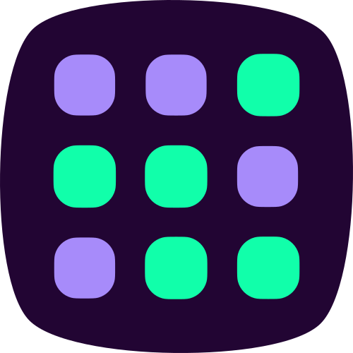
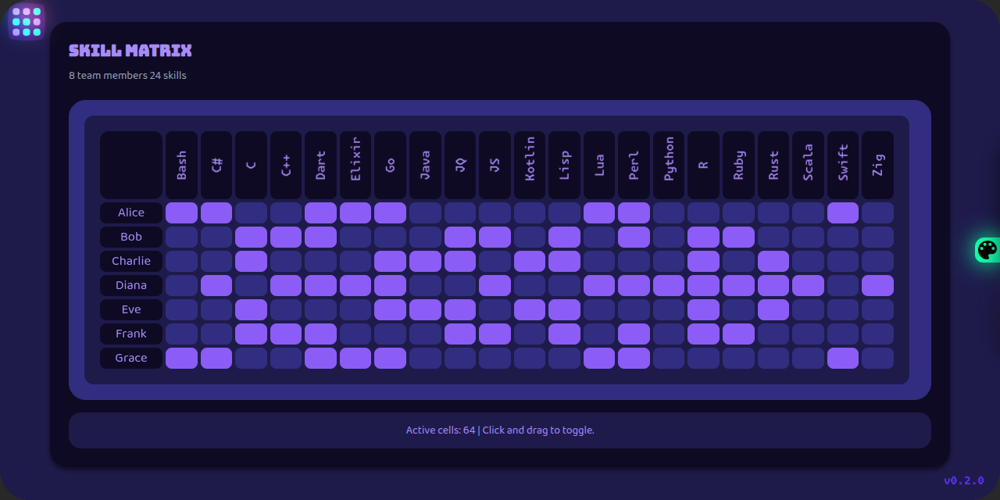
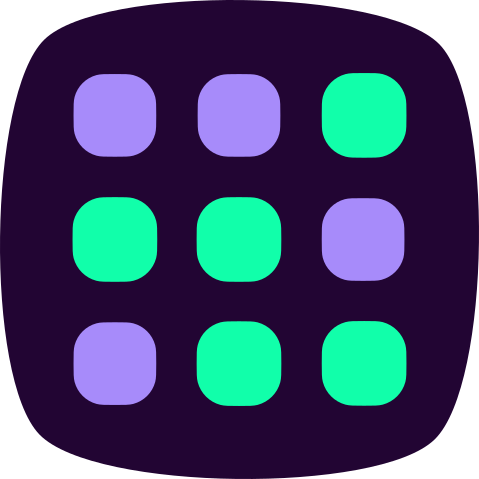

<div align="center">
  <h1>
    
    BitGrid Component
  </h1>
  <strong>
    Framework-agnostic web component for boolean matrices
  </strong>
  <br>
  edit and display 2D boolean arrays
  <br>
  with interactive cell selection
  <br>
  <br>
  
</div>

## Demo and Documentations

<ul>
  <li>
    
    <a href="https://metaory.github.io/bit-grid-component" target="_blank">
      metaory.github.io/bit-grid-component
    </a>
  </li>
</ul>

## Framework Usage Example

<ul>
  <li>
    
    <a href="https://metaory.github.io/bit-grid-component/examples/cdn/" target="_blank">
      /examples/<b>cdn</b>
    </a>
  </li>
  <li>
    
    <a href="https://metaory.github.io/bit-grid-component/examples/vite-vanilla/" target="_blank">
      /examples/vite-<b>vanilla</b>
    </a>
  </li>
  <li>
    
    <a href="https://metaory.github.io/bit-grid-component/examples/vite-react/" target="_blank">
      /examples/vite-<b>react</b>
    </a>
  </li>
  <li>
    
    <a href="https://metaory.github.io/bit-grid-component/examples/vite-vue/" target="_blank">
      /examples/vite-<b>vue</b>
    </a>
  </li>
  <li>
    
    <a href="https://metaory.github.io/bit-grid-component/examples/vite-angular/" target="_blank">
      /examples/vite-<b>angular</b>
    </a>
  </li>
</ul>

> [!TIP]
> Example Sources are under [./examples/](https://github.com/metaory/bit-grid-component/tree/master/examples)

<div align="center">
  
</div>

## Features

- **Web Component**: `<bit-grid>` for 2D boolean matrices
- **Zero-deps ESM**: single-file module, framework-agnostic
- **Selection**: click + drag ranges with debounced updates
- **Events**: `dataChange` event with 2D boolean array
- **API**: `update({ data, rowLabels, colLabels, onChange, debounceMs })`
- **Theming**: CSS custom properties for colors and spacing
- **Examples**: Vanilla, React, Vue, Angular, CDN

## Installation

```bash
npm install bit-grid-component
```

## Usage

### Declarative HTML

```html
<!DOCTYPE html>
<html>
<head>
  <script type="module">import 'bit-grid-component'</script>
</head>
<body>
  <bit-grid></bit-grid>
  
  <script>
    const grid = document.querySelector('bit-grid');
    grid.addEventListener('dataChange', (e) => {
      console.log('Data changed:', e.detail);
    });
  </script>
</body>
</html>
```

### Imperative Update

```html
<bit-grid></bit-grid>

<script>
  const grid = document.querySelector('bit-grid');
  
  grid.update({
    data: Array(7).fill(null).map(() => Array(24).fill(false)),
    rowLabels: ['Mon', 'Tue', 'Wed', 'Thu', 'Fri', 'Sat', 'Sun'],
    colLabels: Array.from({length: 24}, (_, i) => `${i}:00`)
  });
</script>
```

### JavaScript Constructor

```javascript
import 'bit-grid-component';
import BitGrid from 'bit-grid-component';

const grid = new BitGrid({
  data: Array(31).fill(null).map(() => Array(24).fill(false)),
  rowLabels: Array.from({length: 31}, (_, i) => `Day ${i + 1}`),
  colLabels: Array.from({length: 24}, (_, i) => `${i}h`)
});

// ⚠️ Must append to DOM
document.getElementById('container').appendChild(grid);
```

## API

### Constructor Options

```javascript
const grid = new BitGrid({
  data: boolean[][],           // Optional: 2D boolean array
  rowLabels: string[],          // Optional: Array of row labels
  colLabels: string[],          // Optional: Array of column labels
  onChange: function,           // Optional: Callback for data changes
  debounceMs: number           // Optional: Debounce delay (default: 100ms)
});
```

**Inference Priority:**
1. If both `rowLabels` and `colLabels` provided → data generated automatically
2. If `data` provided → labels generated if not provided
3. Default → 5x5 grid with auto-generated labels

### Methods

```javascript
// Get current data
const data = grid.getData();

// Update data and labels (infers dimensions)
grid.update({ data: newData, rowLabels: [...], colLabels: [...] });

// Convenience methods
grid.setLabels(['Row1', 'Row2'], ['Col1', 'Col2']);
grid.setData(booleanArray);
grid.setCell(row, col, true);
grid.getCell(row, col);
grid.toggleCell(row, col);
grid.fill(false); // Fill all cells with value

// Reset to empty grid
grid.reset();
```

### Events

```javascript
grid.addEventListener('dataChange', (e) => {
  const data = e.detail; // 2D boolean array
  console.log('Grid data changed:', data);
});
```

## CSS Customization

```css
bit-grid {
  --grid-primary: #3b82f6;                    /* Active cell color */
  --grid-bg: #ffffff;                         /* Background color */
  --grid-cell-bg: #f8fafc;                    /* Cell background */
  --grid-text: #1f2937;                       /* Text color */
  --grid-text-muted: #6b7280;                 /* Muted text color */
  --grid-header-bg: #f1f5f9;                  /* Header background */
  --grid-hover-bg: #e2e8f0;                   /* Hover background */
  --grid-selection-bg: rgba(59, 130, 246, 0.25); /* Selection background */
  --grid-selection-active-bg: rgba(59, 130, 246, 0.7); /* Active selection */
  --grid-cell-size: 28px;                     /* Cell size */
  --grid-header-width: 80px;                  /* Header width */
  --grid-cell-spacing: 4px;                   /* Cell spacing */
  --grid-cell-radius: 8px;                    /* Cell border radius */
}
```

## Examples

### Monthly Schedule

```html
<bit-grid></bit-grid>

<script>
  const grid = document.querySelector('bit-grid');
  
  // Just provide labels - data auto-generated
  grid.update({
    rowLabels: Array.from({length: 31}, (_, i) => `Day ${i + 1}`),
    colLabels: Array.from({length: 24}, (_, i) => `${i}h`)
  });
  
  grid.addEventListener('dataChange', (e) => {
    const activeHours = e.detail.flat().filter(cell => cell).length;
    console.log(`Active hours: ${activeHours}`);
  });
</script>
```

### React

```jsx
import 'bit-grid-component';
import { useEffect, useRef } from 'react';

function AttendanceGrid({ data, onDataChange }) {
  const gridRef = useRef();
  
  useEffect(() => {
    if (gridRef.current) {
      // Labels-first approach
      gridRef.current.update({
        rowLabels: ['Mon', 'Tue', 'Wed', 'Thu', 'Fri'],
        colLabels: Array.from({length: 24}, (_, i) => `${i}:00`)
      });
      
      // Then set data if provided
      if (data) {
        gridRef.current.setData(data);
      }
      
      gridRef.current.addEventListener('dataChange', onDataChange);
    }
  }, [data, onDataChange]);
  
  return <bit-grid ref={gridRef} />;
}
```

## License

[MIT](LICENSE)
